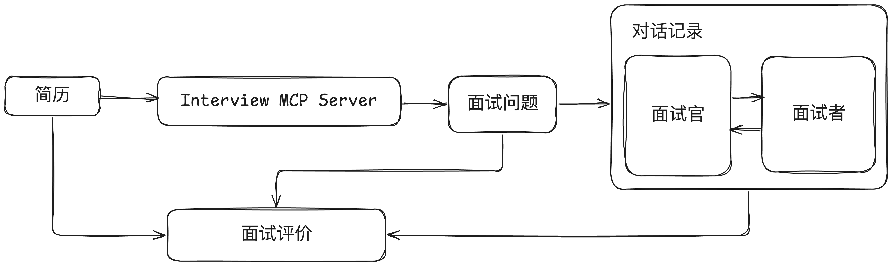

# Interview MCP Server - 一款强大的AI面试辅助工具

Interview MCP Server 是一款强大的MCP Server工具，为公司提供智能化的面试体验。它集成了更加科学实用的简历分析能力，并与主流IDE无缝集成，为面试官提供高效精简的技术面试准备工作流程。

## ❌ 不使用 Interview MCP

面试官在准备技术面试时面临诸多挑战：

- ❌ 需要根据公司需求和职位要求自己准备面试题目
- ❌ 面试题目需要符合公司技术标准和最佳实践
- ❌ 针对不同的面试者，很难做到个性化的面试准备工作
- ❌ 整个面试效率低下，无法全面地评价面试者的能力
- ❌ 依赖经验直觉，仅通过简单交流即做决策，错配风险高
- ❌ 撰写评价报告需要耗费大量时间和精力

## ✅ 使用 Interview MCP

MCP提供智能化的面试准备体验：

- ✅ 智能简历解析：自动从PDF简历中提取关键信息
- ✅ 智能提问：根据简历内容和职位要求生成针对性面试问题
- ✅ 对话记录：完整记录面试对话过程
- ✅ 自动评估：基于对话内容、简历信息、面试问题生成综合评价报告
- ✅ 多职位支持：前端开发、后端开发、测试工程师等职位
- ✅ 多级别支持：初级、中级、高级不同能力级别
- ✅ 多维度评价：技术能力、问题解决能力、团队协作能力，其他能力等
- ✅ 多IDE无缝集成工作流，支持VSCode、Trae等

### 使用流程：

1. 面试官上传pdf简历到某个文件夹
2. 输入：面试者，xxx, 申请高级前端开发，或者直接输入 /question指令,生成面试问题 questions.md
3. 此时会基于简历内容生成12个面试问题
4. 面试官根据面试问题进行面试，利用豆包记录对话内容，生成makdown格式的对话内容 conversation.md
5. 结合questions.md和conversation.md，输入指令 /evaluate 生成评价报告，报告会自动保存到当前文件夹

## 🚀 快速开始
